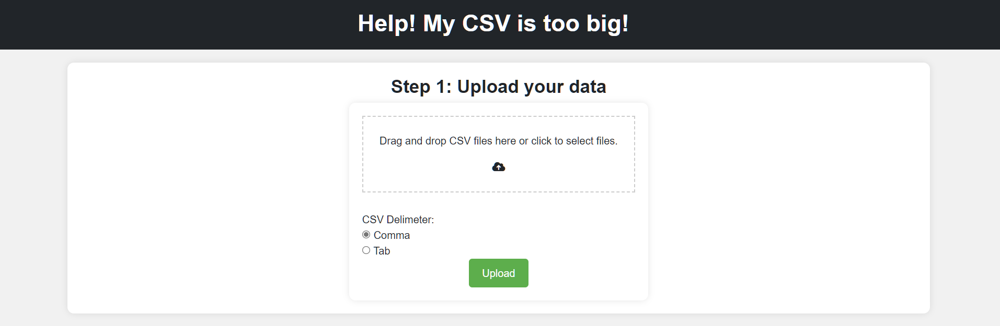
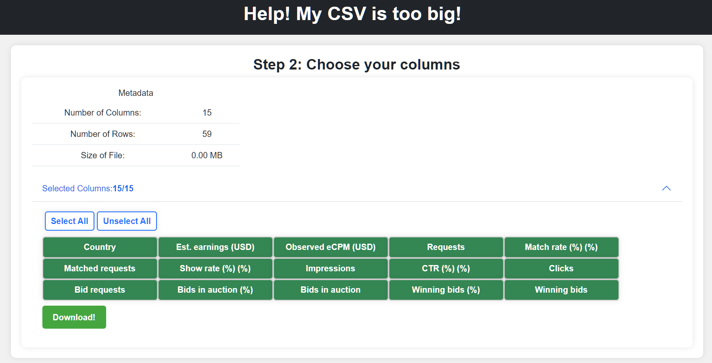

# `team-two` Design Document

## *Help! My CSV is too big!* Design

## 1. Problem Statement

CSV Files are commonly used to store, or transfer information. Spreadsheet programs are the most common way to easily open, edit, and export csv files. Once the size of a csv file increases beyond a certain point, it can be slow, or even impossible to use spreadsheet programs to open, or edit csv files.

This design document describes the "help, my csv is too big" service, which will allow used to upload csv files, view some of its data such as headers, or the number of rows. The service will allow users to filter out columns they don't need, and reduce the amount of information in the file. The service will then return to the user a csv file with only the information they requested.


## 2. Top Questions to Resolve in Review

1. Will S3 be the only service required to query the file, or will I need another service to query the file once it's been uploaded?


## 3. Use Cases

U1. *As a user, I want to be able to upload a csv to the service. I also want to be able to specify what delimiter my file is using.*

U2. *As a user, I want to be able to view the general information about the file I just uploaded (e.g. Row Count, Column Count, Size)*
    
U3. *As a user, I want to be able to select what columns I want.*

U4. *As a user, I want to be able to see general information about specific columns (e.g. for a number column, min, median, max aggregations).*

U5. *As a user, I want to be able to create filters on columns for row-level data that limits the number of rows that are returned (e.g. 'Only show rows where the value of the column field "Color" is "Red"').*

U6. *As a user, I want to be able to download a csv with only the data I selected.*

U7. *As a user, I want to be able to view the files I've previously uploaded, and the filters I've used to download files in the past.*

## 4. Project Scope

### 4.1. In Scope

Uploading a CSV with a specified delimiter to S3.
Displaying some of the files metadata, letting the user choose which columns they are interested in. 
Letting the user download the CSV with only the columns they specified.


### 4.2. Out of Scope
 
Displaying aggregate data information for each column in the file.
Letting the user create filters on fields to limit the rows that are returned.
Letting the user view files previously uploaded, and filters used to download past files.

# 5. Proposed Architecture Overview

We will use springboot and thymeleaf to provide access to two endpoints `/upload` and `/editor`

The `upload` endpoint will allow the user to upload a csv file, and specify what delimiter the file uses. The file will be stored in an AWS S3 bucket. The file delimiter will be stored as UserMetaData in the S3 object holding the file.
Once uploaded, the page will be redirected to the `/editor/{fileName}` endpoint, with the path specifying the file.

The `editor` page will return some CSV metadata, most importantly the column headers. The user will be able to choose which columns they are interested in, and after submitting the form, will have a CSV returned to them.
The form when submitted will access the `/editor/{fileName}/download` endpoint, which will generate a SQL query that is used to query the CSV file in S3. S3 will return the data requested, and the user will receive their file.

# 6. API

## 6.1. Public Models

```
// CsvMetaData

List<String> headers;
String fileName;
int rowCount;
long sizeInKb;
```

## 6.2. *Upload Endpoint*

Accepts `POST` request to `/upload`

Accepts form data to upload a File to S3, and a user-specified delimiter. Converts the file to UTF-8, and uploads the File to S3 with the delimiter specified saved in the file's metadata.


## 6.3 *Download Endpoint*

Accepts `GET` request to `/editor/:fileName/download`

Accepts a request to download a csv. The csv will be generated from the provided `fileName` and filtered by the columns selected by the user in the form.


# 8. Pages



